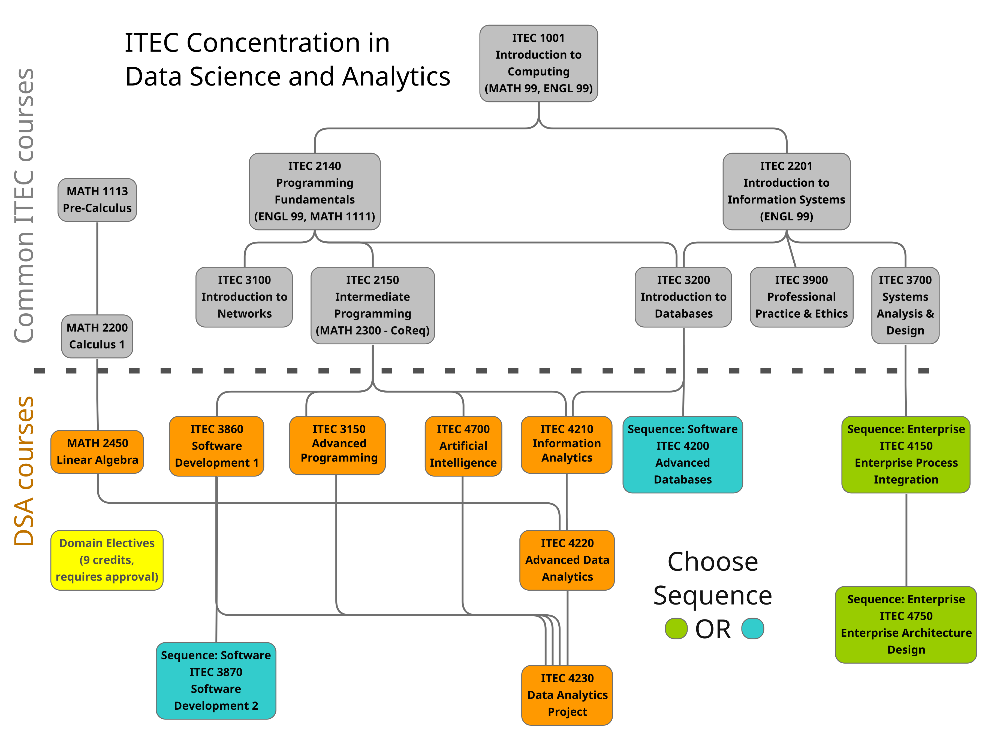
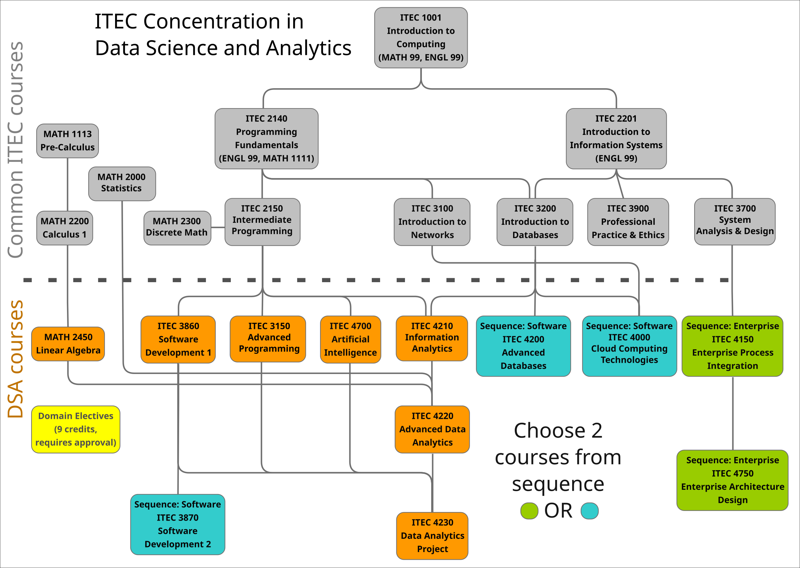
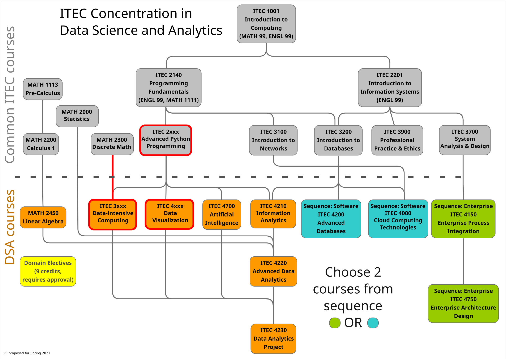
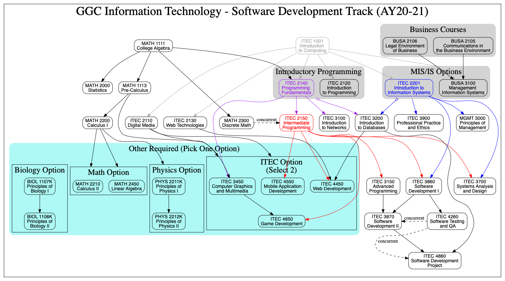

# Contents

* [Proposed changes for DSA](#proposed-changes-for-dsa)
* [Proposed changes for SD](#proposed-changes-for-sd)

# Proposed changes for DSA

## Current in AY19-20

## Approved for AY20-21: Added ITEC 4000 as third elective option

## Proposal draft for AY21-22: 3 new courses replacing existing courses

# Proposed changes for SD

## Current in AY19-20

## Approved for AY20-21: ITEC 3870 prereqs

## Proposed for AY21-22: ITEC 3860 and ITEC 4860 prereqs
