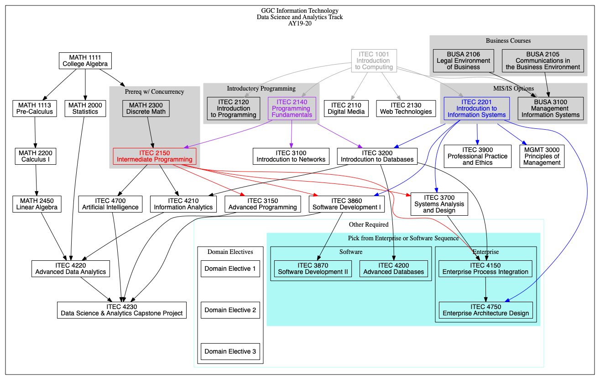
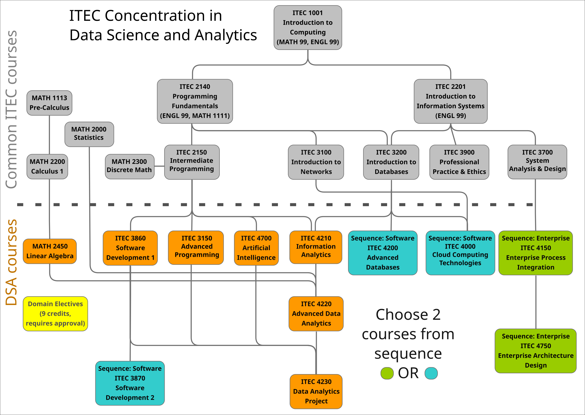
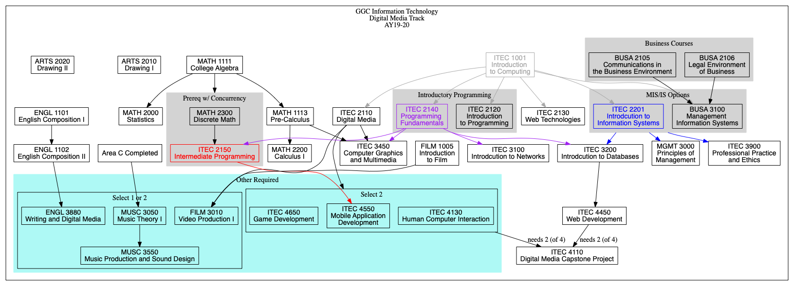
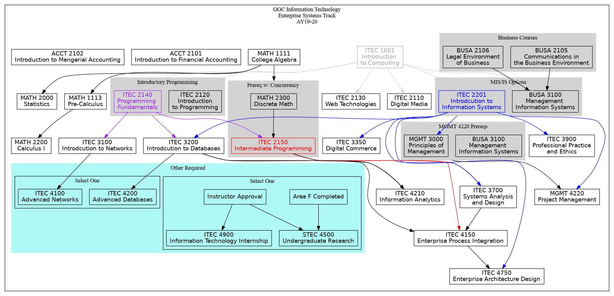
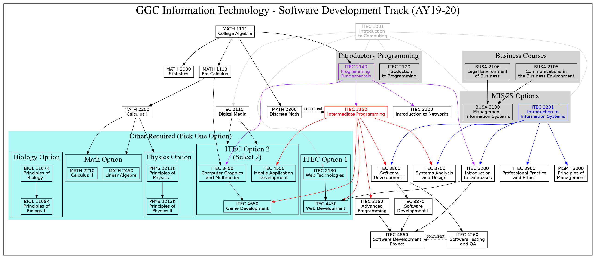
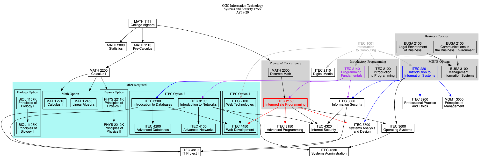

# itec-plans : a landing place for dependency graphs

We use graphviz to convert our course dependency chains in different ITEC tracks to directed graphs

# Steps
Generate directed graphs with:
<pre>
$ cd AY19-20
$ dot -Tpdf DataScienceAndAnalytics.dot -o outputs/DataScienceAndAnalytics.pdf
$ dot -Tpdf DigitalMedia.dot -o outputs/DigitalMedia.pdf
$ dot -Tpdf EnterpriseSystems.dot -o outputs/EnterpriseSystems.pdf
$ dot -Tpdf SoftwareDevelopment.dot -o outputs/SoftwareDevelopment.pdf
$ dot -Tpdf SystemsSecurity.dot -o outputs/SystemsSecurity.pdf
</pre>
or simply

<pre>
$ cd AY19-20
$ ./build.zsh
</pre>

Please see the 'outputs' folder for the generated graphs

# Current plans (AY19-20)

Also see [proposed future changes](CHANGES.md).

## Data Science and Analytics

[PDF link](AY19-20/outputs/DataScienceAndAnalytics.pdf)

Another drawing:

## Digital Media

[PDF link](AY19-20/outputs/DigitalMedia.pdf)

## Enterprise Systems

[PDF link](AY19-20/outputs/EnterpriseSystems.pdf)

## Software Development

[PDF link](AY19-20/outputs/SoftwareDevelopment.pdf)

## Systems Security

[PDF link](AY19-20/outputs/SystemsSecurity.pdf)

